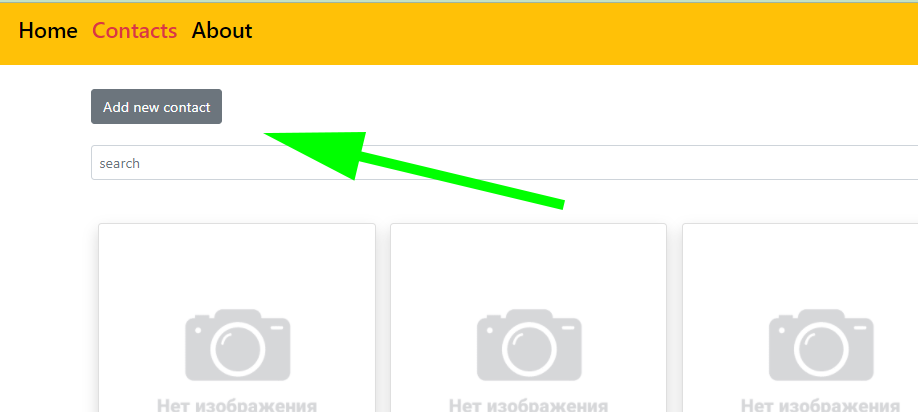
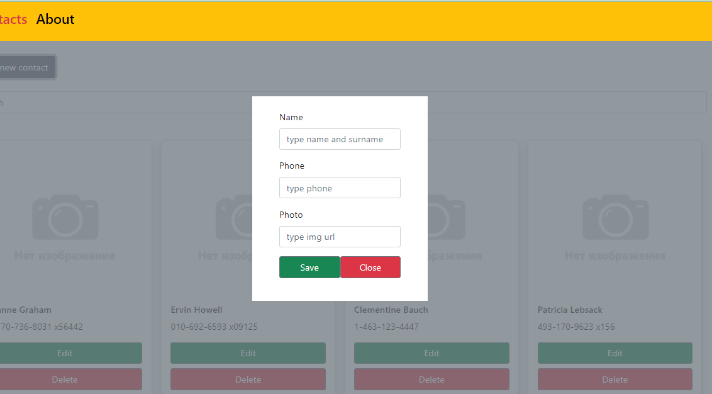
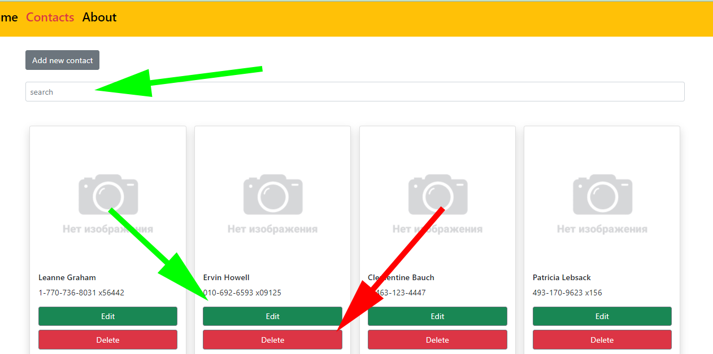

## Available Scripts

In the project directory, you can run:

### `npm start`

Runs the app in the development mode. 
Open [http://localhost:3000](http://localhost:3000) to view it in the browser.

The page will reload if you make edits. 
You will also see any lint errors in the console.

### `npm test`

### App fuctionality

Please go to Contacts page and push "Add new contact" button to show form.

Type data in the form below fields. After that save data or close form.

Check the main section of Contacs page to find search field and list of contacts. To find contact - use search form. You can change contact data - click "Edit" button to show edit fields and change them. Then click "Save" to save it. Also you can delete items by pushing "Delete" button.

